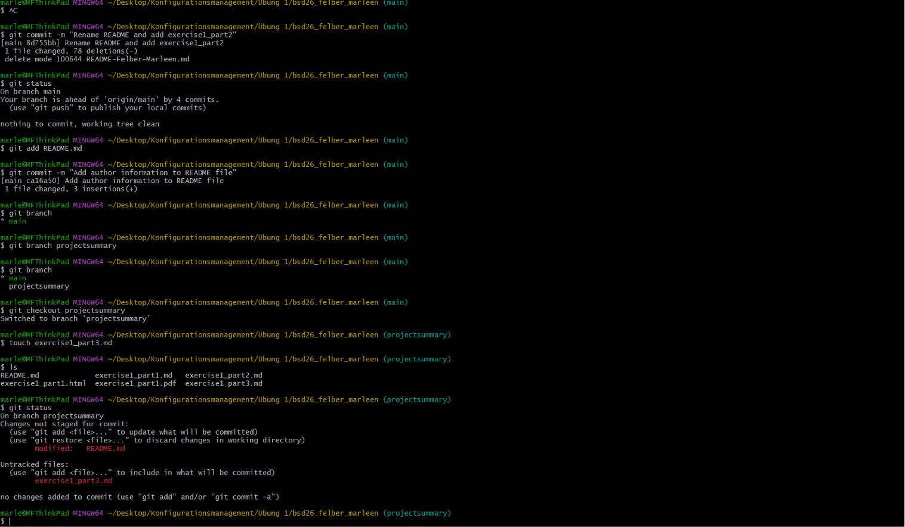

# GitHub: Projekt-Analyse

## FlappySwift
FlappySwift ist eine Nachbildung des bekannten Spiels **Flappy Bird**, welches speziell in der Programmiersprache Swift für \
iOS (Apple) entwickelt wurde. Die Implementierung dessen basiert auf den Code von Matthias Gall, jedoch sind Nate Murray und \
Ari Lerner die Autoren bzw. Entwickler dieses Projekts. Das Projekt ist Open-Source und soll als Lernbeispiel für die \
iOS-Spielentwicklung dienen.

Im Spiel selbst steuert der Spieler einen Vogel, der versucht, zwischen grünen Röhren durchzufliegen, ohne diese zu \
berühren. Nach jedem erfolgreichen Hindernis wird der Punktestand um eins erhöht. 

[Link zum Projekt](https://github.com/newlinedotco/FlappySwift)
