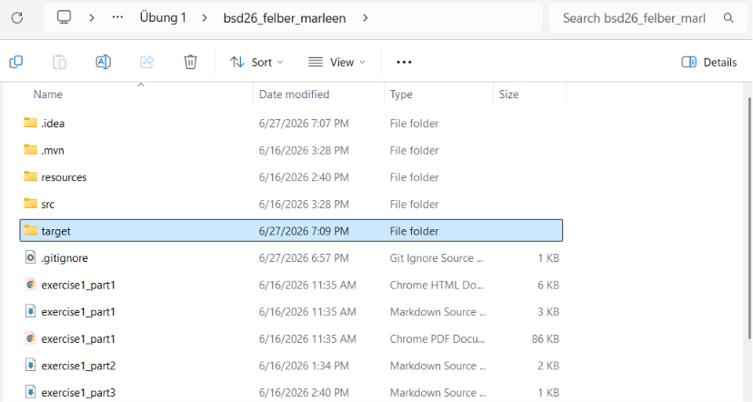
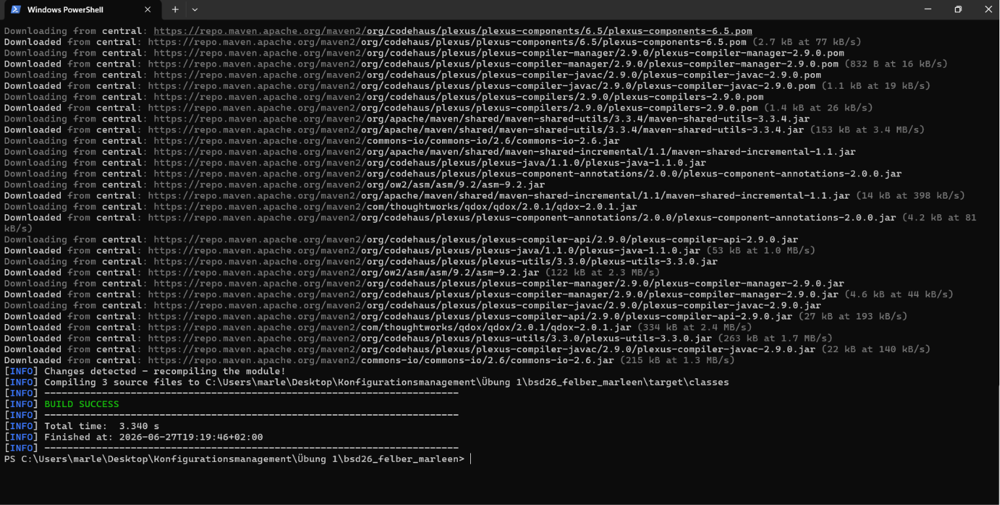
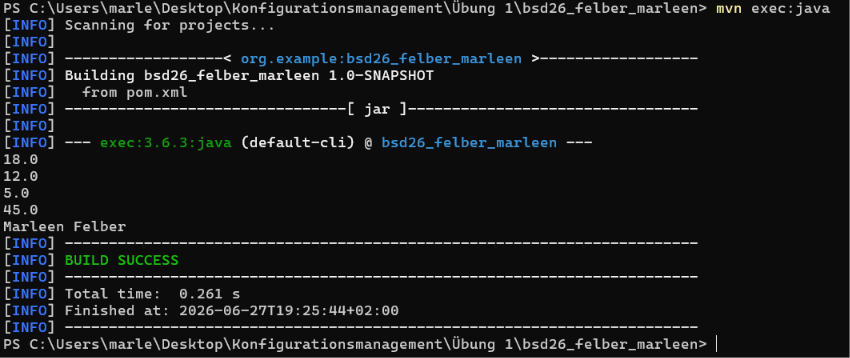
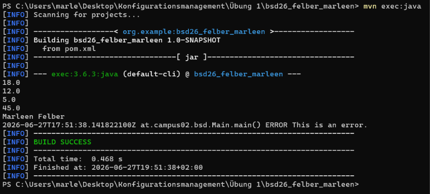
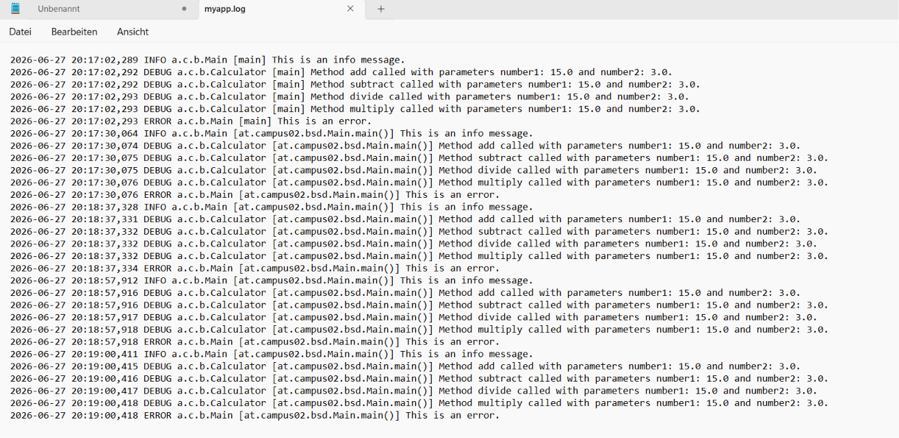

# Dokumentation von Übung 2

# Versionen
* **Java-Version:** 25.0.3
* **Javac-Version:** 25.0.3
* **Maven-Version:** 3.9.16

# Schritte pro Branch

## Branch: init_project
* neues Projekt in IntelliJ angelegt
* .gitignore um .idea erweitert

## Branch: calculator
* Calculator-Klasse (inkl. Methoden) im Package _at.campus02.bsd_ erstellt
* Main-Klasse im selben Package erstellt und alle Calculator-Methoden aufgerufen
* nach Ausführung wurde **zusätzlicher Ordner _target_ erstellt**

* zweiten Block laut Angabe in pom.xml hinzugefügt (1. war bereits vorhanden)
* Plugin in pom.xml hinzugefügt

## Branch: logging
* .gitignore um *.log erweitert
* log4j2 als Abhängigkeit eingebunden
* Logging-Objekt erstellt und zwei Log-Einträge abgesetzt (Level _Info_ und _Error_)

* Mir ist dabei aufgefallen, dass **nur Level _Error_ ausgegeben** wird, aber nicht _Info_. Das liegt laut meiner Recherche daran, dass keine Konfigurationsdatei vorhanden ist.
* Log-Einträge mit Level _Debug_ in jeder Calculator-Methode abgesetzt
* Log-Eintrag mit Level _Error_ in divide-Methode abgesetzt
* log4j2.xml konfiguriert (File Appender, Level _Debug_, Pfad logs/myapp.log, Append-Modus)
* .gitignore um log4j2.xml erweitert
* Kopie von log4j2.xml erstellt und Namen zu log4j2.xml.template geändert
* Tests mehrfach ausgeführt, um Einträge in Logdatei zu bekommen

